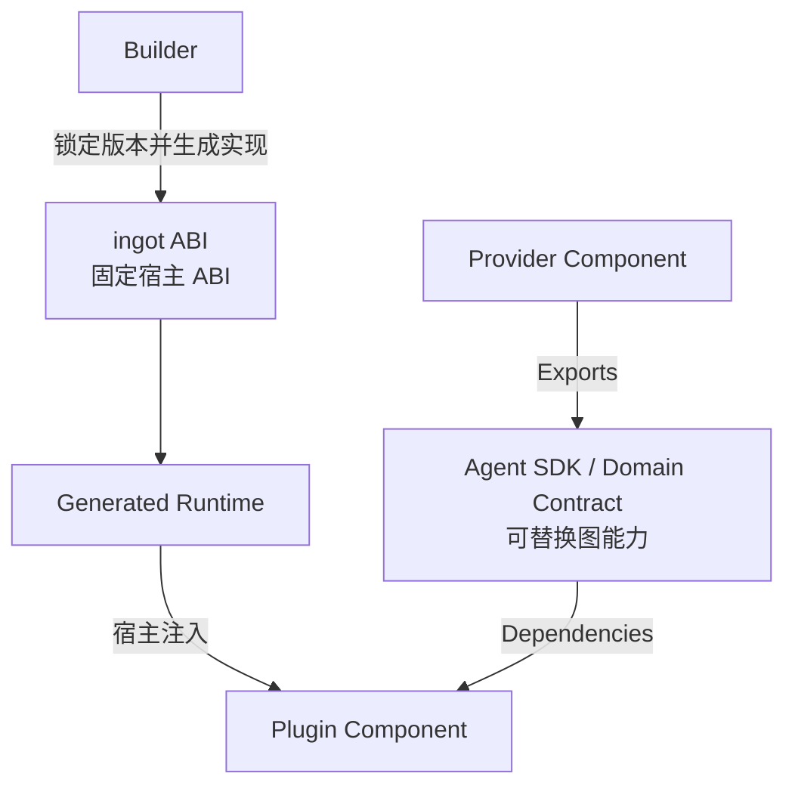

# ingot ABI v0.1 设计提案

> **历史设计 / Historical design — 非当前 API 参考。**
> 本文从 Core 迁入合同所属仓库；当前合同见[仓库 README](../../README.md)、包文档和测试。
> 旧版 `New(ctx, cfg, deps)`、统一 Runtime 配置、静态 Provider 和文本流示例不代表当前 Builder/SDK 接口。
> 原文来源：Core commit `6739c7cb5e90560b75bb39d631c926bc1587c878`，原文采用 [MIT 许可](./LICENSE.mit.txt)。

> 状态：Implemented
>
> 目标：拆分可替换的 Agent Contract 与不可替换的 Runtime ABI
>
> 关联规范：架构 v0.3、SDK v0.1、Builder Config v0.1、Plugin Manifest v0.1

## 1. 背景

ingot 将 Plugin 在构建期组合为静态 Component Graph，由 Builder 生成原生 Runtime Image。现有 `github.com/ingot-agent/sdk` 同时承担了两类性质不同的协议：

1. Component 之间的公共 Agent Contract，例如 `model.Provider`、`tool.Tool`、`session.Store` 和 `interaction.Channel`；
2. Component 与 generated runtime 之间的宿主协议；迁移前包括 `Cleanup`、`config.StateDir` 和 `application.Process`。

第一类能力应由 Plugin 提供并通过 Component Graph 替换。第二类能力由 Runtime Image 拥有和实现，Plugin 无法提供语义等价的替换实现。

两者混合导致了一个直接矛盾：标准 SDK 声明自身是可选、无特殊地位的 Contract Module，但 Builder 又要求每个 configured SDK 必须提供兼容的 root、`config` 和 `application` package，并选择第一个 SDK 作为 primary SDK。因此当前 SDK 在概念上可替换，在 Runtime ABI 上却是 Builder 必须识别的特权模块。

`app.cli` 的 `/exit` 暴露了同一问题：CLI 识别用户结束意图，但只有 generated runtime 能取消全局 Context、执行逆序 Cleanup 并决定进程结果。迁移前的实现通过 `sdk/application.Process.Shutdown` 将该能力注入 Context，工程上可行，但它不属于可替换的 Agent Contract。

## 2. 提案摘要

新增一个独立的 ingot ABI，正式 module path：

```text
github.com/ingot-agent/ingot-abi
```

ingot ABI 是 Plugin 与 generated Runtime Image 之间唯一、固定、不可替换的宿主 ABI。Builder 固定其版本、生成实现并将所需能力注入 Component。

现有 `github.com/ingot-agent/sdk` 回归普通 Contract Module：它只定义多个 Plugin 可以独立实现和替换的 Agent 能力；Builder 不识别它的 module path，也不要求 Runtime Image 必须引入它。



核心原则是：

> ingot ABI 可以特殊，但必须极小；Agent SDK 可以丰富，但绝不能特权化。

## 3. 边界与准入规则

### 3.1 Agent SDK

Agent SDK 描述 Component Graph 内部的协作语义。一个 Contract 只有在存在多个合理、可互换的 Plugin 实现时才应进入 Agent SDK。

保留在 Agent SDK 的现有 package：

| Package | 理由 |
|---|---|
| `agent` | Agent turn 执行可由多个 Plugin 实现 |
| `model` | Provider 与 Runtime 可替换 |
| `tool` | Tool provider 与 invocation runtime 可替换 |
| `session` | Session persistence 可替换 |
| `prompt` | Contributor 与 renderer 可替换 |
| `contextwindow` | Compaction strategy 可替换 |
| `usage` | Token counting strategy 可替换 |
| `interaction` | CLI、Web、policy 或 remote controller 均可实现 |
| `httpx` | HTTP client 可替换 |
| `filesystem` | Workspace filesystem 可替换 |
| `pipeline` | 与具体 Runtime 无关的 typed composition helper |

Agent SDK 不定义 Component 构造签名、进程控制、Builder mode、Plugin state scope 或 generated wiring helper。

### 3.2 ingot ABI

ingot ABI 不是通用工具箱，也不是便利 API 的归宿。一个协议只有同时满足以下条件才可进入：

1. 该资源或语义由 generated runtime 独占拥有；
2. 该协议在 Component Graph 构造前就必须存在，或负责整个 Graph 的生命周期；
3. Plugin 无法提供语义等价的可替换实现；
4. 所有 Runtime Image 都需要统一、可预测的行为；
5. 如果不由 ingot ABI 表达，就只能依赖 Builder 按 Plugin 名特判、全局变量或隐藏通道。

以下能力默认不进入 ingot ABI：

- HTTP client、filesystem、logger、metrics、tracing；
- clock、random、scheduler、event bus；
- secrets、业务配置、model、tool、session；
- UI 协议、前端状态、应用业务命令；
- 任意 `Get(string)`、service locator 或可扩展的全局 registry。

ingot ABI 不依赖 Agent SDK、ingot core 或任何具体 Plugin，并应尽量只依赖 Go 标准库。

## 4. ingot ABI v0.1 建议范围

### 4.1 Component ABI

将当前 SDK root package 的 Builder 基础类型迁入 ingot ABI root package：

```go
package ingotabi

type Cleanup func(context.Context) error

type Optional[T any] struct {
    Value T
    Valid bool
}

func None[T any]() Optional[T]
func Some[T any](value T) Optional[T]

type Named[T any] struct {
    Name  string
    Value T
}

func CheckUniqueNames[T any](items []Named[T]) error
```

它们不是宿主能力，但是 Builder 必须精确识别的 Component ABI，因此不应寄居在可替换的 Agent SDK 中。

Component constructor 固定为：

```go
func New(
    ctx context.Context,
    cfg Config,
    deps Dependencies,
) (Exports, ingotabi.Cleanup, error)
```

Builder 只识别 ingot ABI 的 `Cleanup`、`Optional[T]` 和 `Named[T]`，不再从 configured SDK 列表中搜索等价形状。

### 4.2 Invocation

Invocation 提供 Runtime Image 的只读调用信息：

```go
package invocation

type Mode uint8

const (
    ModeRun Mode = iota + 1
    ModeCheck
)

type Invocation interface {
    Arguments() []string
    Mode() Mode
}
```

`Arguments` 返回 caller-owned copy。`ModeCheck` 是 Builder 与 Runtime Image 之间的构造校验协议；Component 在该模式下可校验 Config 和 Dependencies，但不得启动交互 loop 或占用外部资源。

### 4.3 Process Lifecycle

Lifecycle 仅表达 Plugin 向 Runtime 提交整体结束请求：

```go
package lifecycle

type Controller interface {
    RequestShutdown(error)
}
```

`RequestShutdown` 不直接退出进程，也不允许 Plugin 选择 exit code。它具有以下语义：

- 方法并发安全、不阻塞；
- 第一次请求触发 Runtime Context 取消；
- `nil` 表示正常结束意图，非 `nil` 表示进程级失败原因；
- shutdown 期间收到的非 `nil` 原因与 Cleanup error 一起聚合；
- 最终没有错误时退出 0，存在任一错误时退出 1。

该语义避免现有 first-wins 竞争使正常结束意外覆盖并发 fatal error。

`app.cli` 的 `/exit`、stdin EOF 与 TUI 退出提交 `RequestShutdown(nil)`；frontend loop 不可恢复的错误提交 `RequestShutdown(err)`。Runtime 统一取消其他 Component 并逆序 Cleanup。

### 4.4 Plugin State Scope

Plugin state path 由 Runtime 分配，不是 filesystem Plugin 的可替换 workspace 能力：

```go
package state

type Scope interface {
    Dir() string
}
```

Builder 为每个 Component 注入与其 Plugin identity 对应的 scope。`Dir` 返回绝对路径，只表达持久化位置；文件访问、schema migration 和业务持久化仍由 Plugin 负责。

### 4.5 不进入公开 Runtime API 的配置支持

现有 `config.PluginReference`、`ResolveTables` 和 `Decode` 只由 generated wiring 使用，不是 Plugin 所需的宿主能力。目标状态由 Builder 在 generated root 中生成配置解析 helper，并直接对每个 Plugin root `Config` 做 strict decode。

这些 helper 不进入 Agent SDK，也不作为 ingot ABI 的稳定 Plugin API。

## 5. 宿主能力注入

### 5.1 显式 Dependencies

ingot ABI 不提供通用 `FromContext` service locator。Component 通过 `Dependencies` 显式声明宿主能力：

```go
type Dependencies struct {
    Agent      agent.Runtime
    Invocation invocation.Invocation
    Lifecycle  lifecycle.Controller
    State      state.Scope
}
```

Builder 将 Dependency target 分为两类：

| Target | Provider |
|---|---|
| 普通 Contract type | 按现有 Component Graph 规则解析 `Exports` |
| ingot ABI 保留的 host type | generated runtime 提供 virtual host provider |

Host dependency 不增加 Component 之间的拓扑边，但必须进入 graph inspection 与 generated wiring，从而保持依赖可见、可审计。

### 5.2 保留类型

Builder 对 ingot ABI host type 实施以下约束：

- `Dependencies` 可以引用它们；
- Plugin `Exports` 不得提供它们；
- 它们不参与 ONE/OPTIONAL/MANY 普通 provider 选择；
- Builder 只对精确 ingot ABI type identity 启用宿主注入；
- 具有相同 method set 但不同 nominal identity 的第三方 Contract 仍按普通图能力处理。

ingot ABI 只提供插件所需的读取或请求接口，不公开 `WithProcess`、`WithStateDir` 等面向 generated wiring 的写入 API。generated main 的实现类保持在生成代码中。

### 5.3 权限边界

显式 host dependency 是架构与可审计性边界，不是对敌意 Plugin 的安全沙箱。Plugin 是编译进 Runtime Image 的原生 Go 代码，仍可直接调用 `os.Exit`、读取环境或访问系统资源。如需对敌意代码隔离，必须另行引入进程、容器、WASM 或 OS sandbox 边界。

## 6. Builder 与锁定模型

### 6.1 固定 ingot ABI

ingot ABI 不进入用户可配置的 `[[sdks]]` 列表。每个 Builder 版本固定：

- ingot ABI module path；
- supported semantic import major；
- exact ingot ABI version；
- generated runtime 对 host contract 的实现。

Builder 为 generated root `go.mod` 写入 ingot ABI exact requirement。如果 Go MVS 因为某个 Plugin 要求更新的同 major ingot ABI 而选出不同版本，resolve/build 在加载 Component 前失败，不尝试使用未验证的 Runtime ABI。

### 6.2 Lock 与 Image Identity

`plugins.lock` 单独记录 Runtime ABI，而不把它伪装成普通 configured SDK：

```toml
[runtime]
module_path = "github.com/ingot-agent/ingot-abi"
version = "v0.1.0"
sum = "h1:..."
```

Runtime module path、version、sum 与 Builder version 进入 canonical build manifest 和 Image ID。生产构建不接受用户指定的 ingot ABI path 或 replacement。

### 6.3 普通 Contract Module

Agent SDK 与第三方 Domain SDK 不再需要 Builder 专门配置。它们由 Plugin `go.mod` 引入，使用普通 Go Type Identity 参与 Component Graph，并作为普通 module 记录到 lock 与 Image ID。

目标状态移除：

- primary SDK 概念；
- “每个 SDK 必须提供 root/config/application package”的形状约束；
- 多个 SDK `Cleanup` 之间的 convertibility 检查；
- 向每个 configured SDK 重复注入 `Process` 和 state Context。

`builder.toml` 继续作为稳定的 Builder 配置入口保留；v0.1 当前只包含
`builder_config_version = 1`。旧 `[[sdks]]` 与对应环境变量覆盖不再属于 schema，
并由严格解析拒绝。如未来需要用户对任意 Go module 施加版本约束，应设计通用
module constraint，而不再引入特殊 SDK 类别。

## 7. Runtime 生命周期

generated runtime 统一拥有以下机制：

```text
解析 Runtime 调用参数
  → 创建 signal-aware process Context
  → 创建 Invocation / Lifecycle / State host 实现
  → 按拓扑顺序构造 Component Graph
  → 等待 signal 或 RequestShutdown
  → 取消 Runtime Context
  → 严格逆序执行 Cleanup
  → 聚合 shutdown cause 与 Cleanup error
  → 返回最终进程结果
```

Runtime 机制由 Builder 生成，Plugin 只表达运行结果和资源释放行为。Plugin 不调用 `os.Exit`、不向自身发送进程信号、不取消 parent Context。

`--ingot-check` 模式只构造、校验和清理完整 Graph，不进入应用 loop，也不接受 Plugin shutdown request 作为正常控制流。

## 8. 迁移建议

本提案是公开 Go Contract 的破坏性拆分。建议在新的 ingot ABI v0.1 与 Agent SDK 次版本中集中完成，不长期维护两套 Builder ABI。

### 阶段 1：建立 ingot ABI

- 创建独立 module 和稳定 package 边界；
- 迁移 Component ABI primitive；
- 定义 Invocation、Lifecycle 和 State host contract；
- 为每个导出 contract 建立 external-package conformance test。

### 阶段 2：切换 Builder

- 将 ingot ABI 作为 Builder 固定 ABI；
- 实现 virtual host dependency 解析与保留 target 校验；
- 使用唯一 `ingotabi.Cleanup` 生成 Cleanup stack；
- 将配置解析 helper 移入 generated runtime support；
- 更新 lock、Image ID 和 build inspection。

### 阶段 3：迁移官方 Plugin

- 所有 Component constructor 改用 `ingotabi.Cleanup`；
- Dependencies/Exports 中的 `Optional` 与 `Named` 改用 ingot ABI；
- `app.cli` 显式依赖 Invocation 和 Lifecycle；
- `session.sqlite` 显式依赖 State scope；
- 删除 Plugin 对 `application.FromContext` 和 `config.StateDir` 的依赖。

### 阶段 4：精简 Agent SDK 与配置面

- 从 Agent SDK 删除 root Component ABI、`application` 和 state scope；
- 从 Agent SDK 删除 generated-only config helper 和 TOML dependency；
- 更新 SDK 定位、package inventory 与迁移指南；
- 废弃 primary/configured SDK 语义，并在后续 Builder schema 版本中删除。

迁移必须在同一个可构建的 workspace 变更集中完成，避免出现 Builder 与 Plugin 各自只支持一半协议的中间状态。

## 9. 验证与验收

### ingot ABI

- 公开 API 只包含已批准的 Component ABI 和 host contract；
- 每个 interface 有外部 package compile assertion、nil/ownership 与并发语义测试；
- 不依赖 Agent SDK、ingot core 或具体 Plugin；
- 新增 API 必须通过 Runtime 准入检查。

### Builder

- 缺少 ingot ABI、版本被 MVS 升级或出现未授权 replacement 时构建失败；
- Plugin 导出保留 host type 时构建失败；
- Host dependency 由 generated runtime 注入且可在 inspection 中观察；
- 普通 Contract Module 无需 `[[sdks]]` 声明即可参与类型建图；
- check mode 完整构造与逆序清理 Graph；
- shutdown request、signal、构造错误与 Cleanup error 均获得确定的进程结果。

### 官方 Plugin

- `/exit`、EOF 和 TUI 退出会发起正常 Runtime shutdown；
- frontend fatal error 与 Cleanup error 不会被正常 shutdown 覆盖；
- `app.cli` 不通过 Context 查找进程控制；
- stateful Plugin 只能通过显式 State scope 获得持久化路径；
- 现有 Agent capability 的行为、顺序、ownership 与并发语义保持不变。

## 10. 待讨论问题

1. Runtime module 正式命名为 `github.com/ingot-agent/ingot-abi`；

   ans:已确定并发布 `v0.1.0`

2. Process lifecycle v0.1 是否只提供 `RequestShutdown(error)`，还需要显式 root `Runner` 协议；
   ans:当前版本只提供RequestShutdown，具体协议留给后续迭代

3. Host dependency 是否全部改为显式 `Dependencies` 注入，还是对 Invocation/State 保留少量 Context scope；
   ans:显式注入

4. Agent SDK 现有 v0.1 用户是采用集中破坏性切换，还是提供一个短期迁移版本。
   ans:直接破坏性迁移

这些问题不改变本提案的核心边界：普通 Agent Contract 不得承担 Builder/Runtime 特权，而 Runtime ABI 必须被集中、固定并受严格的最小化约束。
